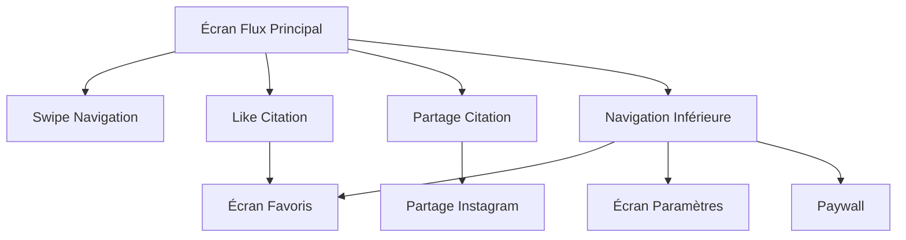

## 1. Product Overview
Aura : Manga Motivation Daily est une application mobile B2C de motivation qui diffuse des citations inspirantes de mangas et de personnalités célèbres. L'application vise à motiver les utilisateurs quotidiennement avec des messages puissants provenant de leurs séries préférées et de figures historiques.

L'application cible les amateurs de mangas et les personnes recherchant une motivation quotidienne, en leur offrant une expérience immersive avec des citations soigneusement sélectionnées dans un format de flux vertical inspiré de TikTok.

## 2. Core Features

### 2.1 User Roles
| Role | Registration Method | Core Permissions |
|------|---------------------|------------------|
| Utilisateur Gratuit | Utilisation anonyme | Accès aux citations de base, favoris limités |
| Utilisateur Pro | Inscription via paywall | Accès illimité, fonctionnalités premium |

### 2.2 Feature Module
L'application Aura se compose des pages suivantes :
1. **Écran de flux principal** : Affichage plein écran des citations avec navigation verticale
2. **Écran des favoris** : Liste des citations likées par l'utilisateur
3. **Écran de paywall** : Présentation de l'offre premium Aura Pro
4. **Écran de paramètres** : Configuration des notifications et préférences

### 2.3 Page Details
| Page Name | Module Name | Feature description |
|-----------|-------------|---------------------|
| Écran de flux | Flux de citations | Afficher chaque citation en plein écran avec typographie premium (serif pour citation, sans-serif pour auteur). Permettre le swipe vertical pour navigation. |
| Écran de flux | Système de favoris | Permettre de liker une citation via bouton cœur. Stocker les favoris localement via AsyncStorage. |
| Écran de flux | Partage de citation | Générer une image de la citation via react-native-view-shot pour partage sur Instagram. |
| Écran de flux | Navigation | Barre de navigation inférieure avec accès aux favoris et paramètres. |
| Écran favoris | Liste des favoris | Afficher toutes les citations likées dans une grille ou liste scrollable. |
| Écran favoris | Gestion des favoris | Permettre de retirer des favoris. |
| Écran paywall | Offre premium | Présenter l'offre Aura Pro (3 jours d'essai, 19.99€/an) avec bouton d'abonnement factice. |
| Écran paramètres | Notifications | Configurer les rappels quotidiens via expo-notifications. |
| Écran paramètres | Préférences | Permettre le réglage de la fréquence des notifications. |

## 3. Core Process

### Flux utilisateur principal :
1. L'utilisateur ouvre l'application et voit immédiatement une citation en plein écran
2. Il peut swiper vers le haut/bas pour naviguer entre les citations
3. Il peut liker une citation via le bouton cœur
4. Il peut accéder à ses favoris via la navigation inférieure
5. Il peut partager une citation via le bouton de partage
6. Après un certain usage, le paywall peut s'afficher pour proposer l'upgrade

### Flux utilisateur favoris :
1. Depuis la navigation inférieure, accéder à l'écran favoris
2. Voir toutes les citations likées
3. Pouvoir retirer des favoris
4. Pouvoir partager depuis cette vue

## 4. User Interface Design

### 4.1 Design Style
- **Couleurs** : Dark mode uniquement avec fond #0F0F0F
- **Typographie** : Serif pour les citations, Sans-serif pour les auteurs et éléments UI
- **Style des boutons** : Minimaliste avec icônes Lucide-react-native, style Apple Design 2026
- **Animations** : Transitions fluides entre citations, effets de dégradé subtils derrière le texte
- **Layout** : Plein écran pour les citations, navigation intuitive

### 4.2 Page Design Overview
| Page Name | Module Name | UI Elements |
|-----------|-------------|-------------|
| Écran de flux | Citation display | Texte en serif avec dégradé subtil pour lisibilité, fond #0F0F0F, bouton cœur en overlay, indicateur de swipe |
| Écran de flux | Barre navigation | Barre inférieure minimaliste avec icônes Lucide, fond semi-transparent |
| Écran favoris | Grille favoris | Grille 2 colonnes ou liste avec aperçu des citations, fond #0F0F0F |
| Écran paywall | Offre premium | Design épuré avec présentation claire de l'offre, bouton d'action principal |
| Écran paramètres | Liste paramètres | Liste scrollable avec toggles pour notifications, design cohérent avec le reste |

### 4.3 Responsiveness
- Mobile-first design optimisé pour iOS et Android
- Support des différentes tailles d'écran via Expo
- Interface adaptée aux gestes tactiles avec zones de toucher optimisées

### 4.4 Animations et Interactions
- Effet de parallaxe subtil lors du swipe
- Animation de transition entre citations
- Feedback haptique sur les interactions principales
- Animation du bouton like avec rebond