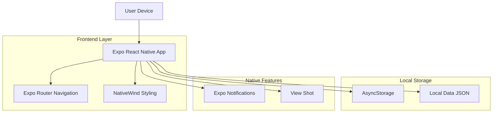
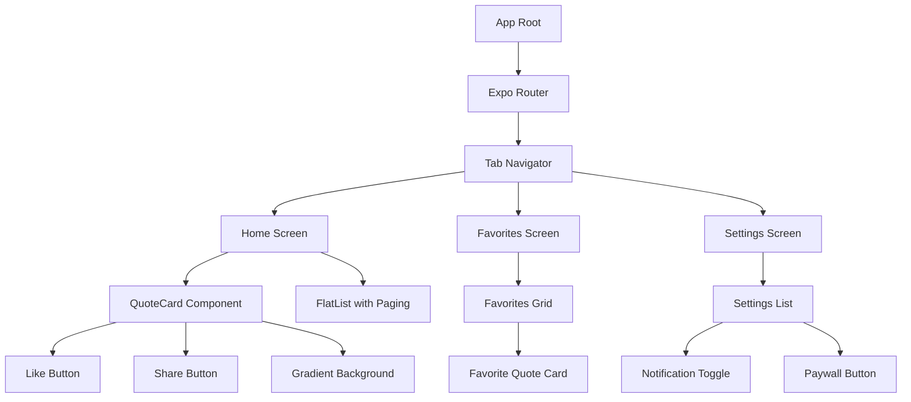

## 1. Architecture design



## 2. Technology Description

- **Frontend**: React Native@0.73 + Expo@50 + NativeWind@4 (Tailwind CSS for React Native)
- **Navigation**: Expo Router@3 (File-based routing)
- **Styling**: NativeWind (Tailwind CSS classes for React Native)
- **Icons**: Lucide-react-native@0.3
- **Storage**: AsyncStorage (local favorites)
- **Notifications**: expo-notifications@0.27
- **Screenshot**: react-native-view-shot@3.8
- **Data**: Local JSON file (data/quotes.json)
- **Initialization Tool**: expo-cli

## 3. Route definitions

| Route | Purpose |
|-------|---------|
| / | Écran de flux principal avec citations |
| /favorites | Écran des citations favorites |
| /settings | Écran de paramètres et notifications |
| /paywall | Écran de souscription premium |

## 4. Data Model

### 4.1 Quote Data Structure
```typescript
interface Quote {
  id: string;
  text: string;
  author: string;
  source: string;
  category: 'Stoïcisme' | 'Mental' | 'Discipline' | 'Ambition';
  aura_level?: number;
}

interface FavoriteQuote extends Quote {
  favoritedAt: Date;
}
```

### 4.2 Local Storage Structure
```typescript
interface AppData {
  favorites: string[]; // Array of quote IDs
  settings: {
    notificationsEnabled: boolean;
    notificationTime: string;
    lastQuoteViewed: string;
  };
  user: {
    isPro: boolean;
    trialEndDate?: Date;
  };
}
```

## 5. Component Architecture



## 6. Key Dependencies

### 6.1 Core Dependencies
```json
{
  "expo": "~50.0.0",
  "react-native": "0.73.0",
  "expo-router": "~3.4.0",
  "nativewind": "^4.0.0",
  "lucide-react-native": "^0.3.0"
}
```

### 6.2 Feature Dependencies
```json
{
  "@react-native-async-storage/async-storage": "1.21.0",
  "expo-notifications": "~0.27.0",
  "react-native-view-shot": "3.8.0",
  "expo-sharing": "~11.10.0",
  "expo-media-library": "~15.9.0"
}
```

## 7. Data Management

### 7.1 Local Data Loading
- Les citations sont chargées depuis `data/quotes.json`
- Chargement asynchrone au démarrage de l'application
- Mise en cache en mémoire pour performance optimale

### 7.2 Favorites Management
- Stockage des IDs des citations favorites dans AsyncStorage
- Synchronisation immédiate des changements
- Persistance entre les sessions

### 7.3 State Management
- Utilisation des hooks React (useState, useEffect)
- Context API pour l'état global si nécessaire
- Pas de Redux nécessaire pour cette échelle

## 8. Native Features Integration

### 8.1 Notifications
```typescript
// Configuration des notifications quotidiennes
await Notifications.scheduleNotificationAsync({
  content: {
    title: "Votre dose de motivation quotidienne",
    body: "Nouvelle citation disponible !",
  },
  trigger: {
    hour: 9,
    minute: 0,
    repeats: true,
  },
});
```

### 8.2 Screenshot & Share
```typescript
// Capture d'écran pour partage
const uri = await captureRef(viewRef, {
  format: "png",
  quality: 0.8,
});

// Partage via Instagram
await Sharing.shareAsync(uri, {
  mimeType: "image/png",
  dialogTitle: "Partager cette citation",
});
```

## 9. Performance Considerations

### 9.1 FlatList Optimization
- Utilisation de `getItemLayout` pour performance optimale
- `initialNumToRender` défini à 3
- `maxToRenderPerBatch` à 5
- `windowSize` à 10

### 9.2 Image Optimization
- Pas d'images lourdes dans l'application
- Utilisation de dégradés CSS plutôt que d'images
- Lazy loading des composants si nécessaire

## 10. Development Setup

### 10.1 Project Structure
```
app/
├── (tabs)/
│   ├── _layout.tsx
│   ├── index.tsx (Home)
│   ├── favorites.tsx
│   └── settings.tsx
├── paywall.tsx
└── _layout.tsx

components/
├── QuoteCard.tsx
├── FavoriteButton.tsx
├── ShareButton.tsx
└── GradientBackground.tsx

data/
└── quotes.json

utils/
├── storage.ts
├── notifications.ts
└── share.ts
```

### 10.2 Environment Configuration
```javascript
// app.json
{
  "expo": {
    "name": "Aura : Manga Motivation Daily",
    "slug": "aura-manga-motivation",
    "plugins": [
      "expo-notifications",
      "expo-media-library"
    ]
  }
}
```